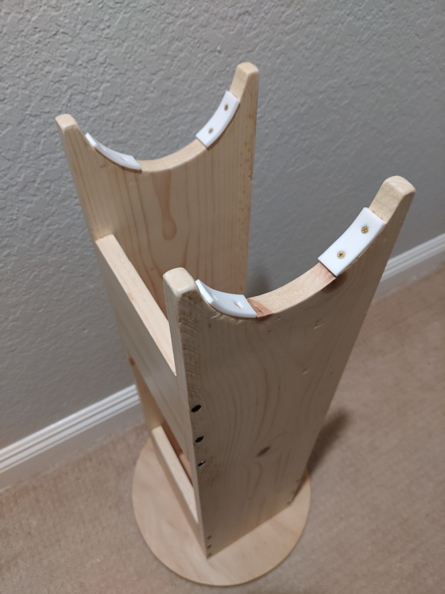

# Wooden Rocker Box for Hadley Telescope

For a 3D version that you can look around and take apart, see [RockerBaseV3.f3d](RockerBaseV3.f3d)

# Disclaimer
This isn't the best or most cost-effective design for a wooden rocker, just a record of the one that I built. Feel free to change things if you feel they would be better, just make sure to adjust any other parts of the plan that would be influenced by that change.

**Important:** Since this plan uses roughly 3/4" side boards, you'll need either the wider wooden rocker mount interface (
Mount_Interface_wider_WOOD-ROCKER-ONLY.stl) or the spacers to make the default mount interface wider.

# Credits
Thanks to the other folks who have posted their wooden rocker build pictures on the Hadley Discord for the inspiration and to my dad for lots of help and guidance on this project!

# Goal
These instructions should result in a wooden rocker like the one in the picture below.\

# BOM

## Cost Note
The below BOM reflects how I built it, you should be able to substitute the $30 PTFE sheet for $10 PTFE furniture sliders [like these](https://www.amazon.com/CSFMC-Furniture-Sliders-Cabinet-Stainless/dp/B095DV2BXF/). These are 3/4" diameter which nearly matches the width of the side boards. Make sure to get Teflon/PTFE, other materials will not be as slippery. You'll also need to cut the top semi-circles a bit wider to account for the increased thickness of the furniture sliders.

## List
* 1x 8' 1x8 softwood board [Link](https://www.homedepot.com/p/1-in-x-8-in-x-8-ft-Premium-Kiln-Dried-Square-Edge-Common-Softwood-Boards-914835/100065210) (US$17) 
* 1x 4' x 2' x 3/4" plywood sheet [Link](https://www.homedepot.com/p/3-4-in-x-2-ft-x-4-ft-Radiata-Pine-Plywood-Actual-0-719-in-x-23-75-in-x-47-75-in-414716/313354420) (US$33)
* 1x 6"x6"x1/8" Teflon sheet [Link](https://www.amazon.com/dp/B094W8S9X7?ref=ppx_yo2ov_dt_b_product_details&th=1) (US$30)
* 14x #4x5/8 flat head wood screws (not needed if you use the above PTFE furniture sliders with included screws) [Link](https://www.homedepot.com/p/4-x-5-8-in-Phillips-Flat-Head-Brass-Wood-Screw-4-Pack-809511/204275701) (US$6 for 16)
* 3x 1/4in-20 x 5/16in Tee nuts [Link](https://www.homedepot.com/p/Everbilt-1-4-in-20-Zinc-Plated-Tee-Nut-4-Pack-802301/204274194) (US$2 for 4)
* 1x 5/16in-18 x 2.5in steel hex bolt (I used one without threads on part of it that I had laying around, unlike the one linked, but both should work) [Link](https://www.homedepot.com/p/Everbilt-5-16-in-18-x-2-1-2-in-Stainless-Steel-Hex-Bolt-812336/301936037) (US$2)
* 2x 5/16in x 1.5in washer [Link](https://www.homedepot.com/p/Everbilt-5-16-in-x-1-1-2-in-Zinc-Plated-Fender-Washer-804806/204632770) (US$1)
* 1x 5/16in-18 hex nut [Link](https://www.homedepot.com/p/Everbilt-5-16-in-18-Zinc-Plated-Hex-Nut-801746/204647888) (US$1)
* 24x #6x2" drywall screws [Link](https://www.homedepot.com/p/Grip-Rite-Grip-Rite-6-x-2-in-Philips-Bugle-Head-Coarse-Thread-Sharp-Point-Drywall-Screws-1-lb-Pack-2CDWS1/100128601) (US$9 for 166) (Note: drywall screws will rust if you even think about water, so consider self-starting exterior screws or be prepared to seal them)
* 3x 1/4-20 x 2.5" hex bolts [Link](https://www.homedepot.com/p/Everbilt-1-4-in-20-x-2-1-2-in-Zinc-Plated-Hex-Bolt-800626/204633263) (US$1)
* 3x 1/4-20 x 1.25" washer [Link](https://www.homedepot.com/p/Everbilt-1-4-in-x-1-1-4-in-Zinc-Plated-Fender-Washer-804796/204632767) (US$1)
* 6x 1/4-20 hex nuts (3 of them would be used by future 3D printed feet) [Link](https://www.homedepot.com/p/Everbilt-1-4-in-20-Zinc-Plated-Hex-Nut-801736/204647886) (US$1)
* 1qt matte water-based polyurethane (Optional, for water resistance) [Link](https://www.homedepot.com/p/BEHR-1-qt-Matte-Clear-Water-Based-Interior-Fast-Drying-Polyurethane-B810604/311623004) (US$25)

Total pre-tax cost (w/polyurethane): ~$129

# Tools and Items Needed
* Drill
* A few drill bits (I used 5/16", 1/4", 3/32", 1/16")
* Screw driver drill bit (phillips for me, but some screws use different bits)
* Wood cutting tools (I used a circular saw and jig saw, but a table saw and band saw would likely be better)
* Knife for cutting and trimming the PTFE
* Small screwdriver
* Rough and fine grit sandpaper (I used 80 and 220)
* Square (I used a large and small square)
* Pencil
* String or cardboard for radius of top base
* Cardboard for outline of bottom base
* Some way of measuring 120°
* Hadley Z-bearing for reference
* Brush for the polyurethane

Planning
====

## Top Base
Pretty simple:\

We want a circle with a 14" diameter. Put a small nail where you want the center to be and use a 7" long string or piece of cardboard to trace a circle onto the plywood.

Tip: Start near a corner of the plywood sheet so you have room for the bottom base.

## Bottom Base
This is a bit tricky, I recommend drawing it out on a piece of cardboard in pencil and then cutting out the shape before transferring it to the plywood. 

1. Choose a center point and draw the 3" line centered on it
1. Then at each end of that 3" line draw the 10" lines square to it
1. Connect the ends of the two 10" lines with a square 3" line to get the main black square in the diagram
1. From the center point, draw a 4" line square relative to the 3" line
1. Rotate 120° (easier said than done?)
1. Repeat twice, once for each of the blue squares in the diagram
1. Connect the outer corners of the squares with the end of the 4" line to get the outer perimeter
1. Cut out the cardboard to the outer perimeter
1. Place the cardboard on the plywood sheet and trace out design onto the plywood

## Tall sides
These are just cut from the 1x8 board.
I recommend making them 28" tall. Pencil in lines on the 1x8 board for two 28" segments.

Here's the goal:\

### Bearing cutouts
**Note**: If you are using furniture sliders instead of 1/8" PTFE, you'll need to take into account their thickness and not simply use the outer edge of the Z bearing as I do here for my 1/8" PTFE strips.

You probably should do this after you have cut the 28" segments, but this is the planing section so putting it here.

1. Center the Z bearing left-right on the top of the segments
1. Keeping it centered left-right, move it up or down so the top of the wood meets the _lower_ hole of the bearing (when not cut, this would be the purple line in the diagram)
1. Trace the outer (raised) edge of the bearing (Note: this only will give the right diameter if you're using 1/8" Teflon pads, as the raised edge is about 1/8" beyond the wider base)

## Cross pieces
Again, make sure you're using the wider mount interface or have the extra spacers!

Goal:\

1. Measure the width from the *insides* of the outer rim of the Z bearings (black line in diagram) (Don't use my measurements - but it should be something in the ballpark of 8 3/8")
1. Measure the width (shortest dimension) of your 1x8 boards (tip: 1x8 boards are _not_ 1" by 8") (something near 3/4" each)
1. Subtract 2\* the width of your boards (step 2) from the total width found in step 1 to get the width of the cross pieces (Again, measure yourself, but expect something like 8 3/8" - 1 1/2" = 6 7/8")
1. Using the distance found in step 3, mark out 3 cross pieces on your 1x8 board (mark lines across the width of the board)

# Cutting
## Note
If you have nice woodworking equipment like a table saw and/or band saw, that would probably be easier. I just had a jig saw and a circular saw, so my cuts were fairly rough.

## Cuts
When cutting you want to be square in multiple dimensions (ie cutting along a straight line, but your blade is also straight up and down), so take your time to get everything lined up nicely! 

Ideally you would just be following the lines your traced out in the planning step.

After cutting you should have:
* 2x tall side pieces with the semi-circle cut out of them
* 3x cross pieces
* 1x circular top base
* 1x triangular-ish? bottom base 

# Finishing

I sanded each part with 80 grit first then finished up with 220 grit. I also took the time to slightly round the exposed edges to make them less sharp.

I didn't stain the wood, but if you wanted to, do that before polyurethane.

It is optional, but for durability and water-resistance I polyurethaned each of the pieces after they were cut. After initial sanding, I cleaned each part of dust and applied 3-4 coats of polyurethane with a foam brush. Between each coat (and after it has dried) I sanded lightly with 220 grit sandpaper. Try to be careful to not sand the cut edges out of square.

# Basic Assembly

## Top box
Goal (semi-see-through with screws):\

As a general best practice, you should pre-drill small [pilot holes](https://www.thehandymansdaughter.com/how-to-drill-pilot-hole/) before inserting the screws. Use a drill bit equal to or slightly smaller than the core of the screw (that is the solid center not including threads). For my #6 drywall screws, I use a 3/32" drill bit for this. Since I lack proper [counter-sinking](https://www.thehandymansdaughter.com/how-to-countersink-screws/) drill bits, after drilling the pilot hole, I just switched to a 5/16" bit and very carefully drilled a shallow ~1/4" deep hole. With a regular drill bit it can be very easy to go too deep so be careful!

Depending on your equipment and number of helpers, there could be many ways to assemble this. My dad and I worked on this part together with the help of a [small square](https://www.homedepot.com/p/Empire-8-in-x-12-in-Steel-Carpenter-Square-100/100148335). 

We started from the bottom, laying one tall side flat on top of the 3 side pieces (**make sure you screw into the cut sides of the cross pieces and not the original milled sides!!**). We lined up one cross piece with the bottom edge and side of the tall piece and put the other pieces under as well for support (exact placement not needed). Using the square to make sure everything was square as possible, we drilled the pilot holes, then counter-sunk and inserted the screws.

Kind of like this:\

Repeat for the other bottom cross piece.

For the top piece, I placed it about 4 inches below the top and otherwise used the same process as the bottom cross pieces\

Next we flipped it over and did the same process for the other side:\

Now you should have an assembled top box!

## Attaching round top base
Goal:\

Before we do this, use a 5/16" drill bit to drill a hole at the center of the round - you should have a small mark from the nail you used to trace the circle. Be careful to drill straight up and down. We don't want it to be super tight, so apply a very small amount of side to side pressure while running the drill through the hole a few times to widen it just a bit.

The tricky part here is getting the screws lined up with the top box. This is how I did it, there could be much better ways.

We'll first find where the corners of the top box should be on the round base, following the image below

Notation note: A is the width (from outside of one tall side to outside of the other tall side) of your assembled rocker box, B is the depth (width of a single tall side from edge to edge)

1. On the top side of the bottom round, draw a straight line through the middle, make sure it is long enough to get past the edges of the top box
1. Mark a point at A/2 from the center and draw a line square from line #1 (repeat in other direction and on other side)
1. Mark points B/2 away from the lines #1 and #2 intersections and draw a small line through them
1. The intersections of the lines #2 and #3 should be the outer corners of the box
1. Place the box on top of the round base and line it up with the corners (the tall sides should go along line #2)
1. Trace the inside and outside of the top box with a pencil to get the gray lines in the second diagram
1. You can now choose where to put the screw pilot holes, put two screws into each of the tall sides, and one screw each into the bottom cross pieces. You want them right in the middle and not too close to the end, to avoid splitting.
1. Drill the pilot holes into the round board only (this was for simplicity and I tested the end of a scrap piece of the 1x8 board and found it didn't split when I put a drywall screw into it without a pilot hole, YMMV)
1. Partially insert screws into the bottom (from the side without the markings!) so they don't protrude (see picture 1)
1. Place top box upside down on the ground (see picture 2)
1. Carefully line up the bottom round on top of the top box using the corners and outline you made before.
1. Ideally with someone helping you, hold the top and bottom together and screw in the screws

(Screws won't be there yet, only there for reference):\

After step 6 you should get the gray lines (screws will only be there after step 10):\

After step 9:\

After step 10:\

Phew! Ideally now you have something that looks like our goal image above and the hardest part is behind us!

## Finishing the top box
Goal:\

Our task here is to attach the Teflon/PTFE pads to the bearing cutouts

### Cutting the PTFE sheet
Cut out 4 strips from the PTFE sheet, roughly 1.5-2 inches long and as wide as the 1x8 (I traced the width of a leftover piece of the 1x8 on the sheet).

Be careful when cutting! PTFE is slippery! I just ran a sharp knife over the spot I wanted to cut 4-6 times to get through the full sheet.

Now we'll need to drill pilot holes and counter-sinks. I used a very small 1/16" drill bit for the pilot holes and a 1/4" drill bit for the counter sink. Be extremely extremely careful when drilling the counter-sink holes (maybe practice on a corner), for my drill bit, I could only go about 1/4 turn to get to the right depth and used a knife to complete the circle. 

The left two holes are examples of the counter-sink going too far:\

You'll want your Hadley (or at least MTA) handy for this step. For the placement of the PTFE strips, you'll want to align the top of the strip with the extreme of the travel of the Z bearing at slightly past vertical and slightly past horizontal, corresponding to the red lines in the following images:\

### Fastening the PTFE strips
**Note**: This part will be a bit different if you chose the PTFE furniture sliders

\

With the PTFE strip aligned with the mark you just made and flush with the *outer* edge of the side board, drill the top pilot hole into the wood.

Using a screwdriver and the small #4x5/8 wood screws, screw the top screw most of the way in.

Align the PTFE strip to be flush with the outside of the side wood piece again and drill the second, lower, pilot hole into the wood. Screw in the second screw and tighten both so they are below the surface level of the PTFE.

Repeat for all 4 PTFE strips on the top.

## Setting up the bottom base
Goal:\

### Drill center hole
Drill a 5/16" hole in the very middle to match the hole we drilled into the center of the round top base. We don't want it to be super tight, so apply a very small amount of side to side pressure while running the drill through the hole a few to widen it just a bit.

### Tee nuts
Goal (x3) (from bottom):\

Next step is adding the 1/4" tee nuts for the feet. About 1.5" in from the edge, and centered, drill a 5/16" hole (my 1/4" tee nut has a 5/16" OD) in each "arm" of the base. Pay extra attention to drilling in straight down otherwise your feet will be at an angle.

After drilling, from the *bottom* side (opposite of the PTFE strips), hammer in the tee nut until the base is touching the surface of the wood.

Repeat for the other 2 "arms".

### PTFE strips
Cut 3 PTFE strips (something like 1.5"x1"), drill pilot holes and counter-sink carefully as with the top box PTFE strips.

Even though the top base round piece is 14" diameter, in case you want to add a 12" diameter vinyl record or 12" UHMW sheet later for more slippery, I'd recommend making the outer edges of the PTFE strip just shy of 6" from the center hole.

Follow the same process as before for attaching them with the 5/8" screws.

## Add the feet
Goal (x3):\

1. Put a 1/4" nut on each of the 3 1/4"x2.5" bolts
1. Put a 1/4" washer on each of the bolts.
1. From the top, thread the bolt into the tee-nut
1. Expose a 1/2" or so of the bolt beneath the tee nut to act as feet

In the future, I hope to add 3D printed feet for these bolts that fit in with the extra three 1/4" hex nuts

OK! Time for final assembly!

# Final Assembly

## Combine top and bottom
Goal:\
Bottom:\

Top:\

1. Put a 5/16" washer on the 5/16" bolt and slide it from the bottom through the bottom base.
1. Carefully line up the top assembly over the screw and slide it down over it.
1. Put another 5/16" washer on the top side followed by the 5/16" hex nut
1. Gently tighten
 
## Sealing screws
I haven't done it yet, but if you used drywall screws, this is a reminder to seal them so they don't rust.

# All done!
If neither you nor I have forgotten any steps, you should have a functional wooden rocker for your Hadley! Wishing you clear skies!

# Possible Future Improvements
* 3D printed feet
* Tension springs for the altitude axis, mine is a bit looser than I'd like
* Vinyl record or UHMW sheet attached to round base to make side to side axis a bit smoother
